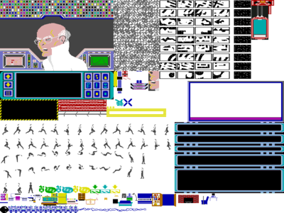
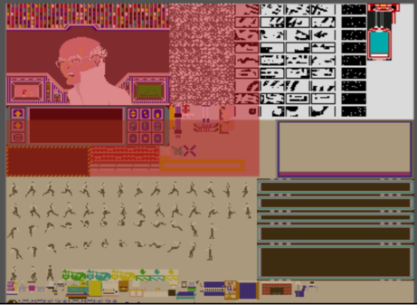

# 🧩 Project Anatomy

_How the pieces fit together..._

Here I'll provide an overview of the project's internal landscape: the key pieces, their roles, and how they combine to form the bigger picture.

## 📐 Sprites

A typical sprite sheet structure is that individual sprites are extracted as separate, non-overlapping rectangles. Each element gets its own entry. There are generally no "composite" or "section" sprites that contain other sprites. That's _not_ the case with the sprite sheet I'm using.

That's an 800x600 sprite sheet but that's structured in a potentially interesting way:

<table>
  <thead>
    <tr>
      <th>Name</th>
      <th>Top X</th>
      <th>Top Y</th>
      <th>Width</th>
      <th>Height</th>
      <th>Element</th>
    </tr>
  </thead>
  <tbody>
    <tr><td>sprite1</td><td>0</td><td>0</td><td>497</td><td>339</td><td>top panel</td></tr>
    <tr><td>sprite2</td><td>708</td><td>0</td><td>64</td><td>112</td><td>elevator</td></tr>
    <tr><td>sprite3</td><td>499</td><td>1</td><td>48</td><td>21</td><td>puzzle, 1:col2</td></tr>
    <tr><td>sprite4</td><td>549</td><td>1</td><td>48</td><td>21</td><td>puzzle, 1:col3</td></tr>
    <tr><td>sprite5</td><td>599</td><td>1</td><td>48</td><td>21</td><td>puzzle, 1:col4</td></tr>
    <tr><td>sprite6</td><td>659</td><td>1</td><td>48</td><td>21</td><td>bpuzzle, 1</td></tr>
    <tr><td>sprite7</td><td>499</td><td>26</td><td>48</td><td>21</td><td>puzzle, 2:col2</td></tr>
    <tr><td>sprite8</td><td>549</td><td>26</td><td>48</td><td>21</td><td>puzzle, 2:col3</td></tr>
    <tr><td>sprite9</td><td>599</td><td>26</td><td>48</td><td>21</td><td>puzzle, 2:col4</td></tr>
    <tr><td>sprite10</td><td>659</td><td>26</td><td>48</td><td>21</td><td>bpuzzle, 2</td></tr>
    <tr><td>sprite11</td><td>499</td><td>51</td><td>48</td><td>21</td><td>puzzle, 3:col2</td></tr>
    <tr><td>sprite12</td><td>549</td><td>51</td><td>48</td><td>21</td><td>puzzle, 3:col3</td></tr>
    <tr><td>sprite13</td><td>599</td><td>51</td><td>48</td><td>21</td><td>puzzle, 3:col4</td></tr>
    <tr><td>sprite14</td><td>659</td><td>51</td><td>48</td><td>21</td><td>bpuzzle, 3</td></tr>
    <tr><td>sprite15</td><td>499</td><td>76</td><td>48</td><td>21</td><td>puzzle, 4:col2</td></tr>
    <tr><td>sprite16</td><td>549</td><td>76</td><td>48</td><td>21</td><td>puzzle, 4:col3</td></tr>
    <tr><td>sprite17</td><td>599</td><td>76</td><td>48</td><td>21</td><td>puzzle, 4:col4</td></tr>
    <tr><td>sprite18</td><td>659</td><td>76</td><td>48</td><td>21</td><td>bpuzzle, 4</td></tr>
    <tr><td>sprite19</td><td>499</td><td>101</td><td>48</td><td>21</td><td>puzzle, 5:col2</td></tr>
    <tr><td>sprite20</td><td>549</td><td>101</td><td>48</td><td>21</td><td>puzzle, 5:col3</td></tr>
    <tr><td>sprite21</td><td>599</td><td>101</td><td>48</td><td>21</td><td>puzzle, 5:col4</td></tr>
    <tr><td>sprite22</td><td>659</td><td>101</td><td>48</td><td>21</td><td>bpuzzle, 5</td></tr>
    <tr><td>sprite23</td><td>499</td><td>126</td><td>48</td><td>21</td><td>puzzle, 6:col2</td></tr>
    <tr><td>sprite24</td><td>549</td><td>126</td><td>48</td><td>21</td><td>puzzle, 6:col3</td></tr>
    <tr><td>sprite25</td><td>599</td><td>126</td><td>48</td><td>21</td><td>puzzle, 6:col4</td></tr>
    <tr><td>sprite26</td><td>659</td><td>126</td><td>48</td><td>21</td><td>bpuzzle, 6</td></tr>
    <tr><td>sprite27</td><td>499</td><td>151</td><td>48</td><td>21</td><td>puzzle, 7:col2</td></tr>
    <tr><td>sprite28</td><td>549</td><td>151</td><td>48</td><td>21</td><td>puzzle, 7:col3</td></tr>
    <tr><td>sprite29</td><td>599</td><td>151</td><td>48</td><td>21</td><td>puzzle, 7:col4</td></tr>
    <tr><td>sprite30</td><td>659</td><td>151</td><td>48</td><td>21</td><td>bpuzzle, 7</td></tr>
    <tr><td>sprite31</td><td>499</td><td>176</td><td>48</td><td>21</td><td>puzzle, 8:col2</td></tr>
    <tr><td>sprite32</td><td>549</td><td>176</td><td>48</td><td>21</td><td>puzzle, 8:col3</td></tr>
    <tr><td>sprite33</td><td>599</td><td>176</td><td>48</td><td>21</td><td>puzzle, 8:col4</td></tr>
    <tr><td>sprite34</td><td>659</td><td>176</td><td>48</td><td>21</td><td>bpuzzle, 8</td></tr>
    <tr><td>sprite35</td><td>499</td><td>201</td><td>48</td><td>21</td><td>puzzle, 9:col2</td></tr>
    <tr><td>sprite36</td><td>549</td><td>201</td><td>48</td><td>21</td><td>puzzle, 9:col3</td></tr>
    <tr><td>sprite37</td><td>599</td><td>201</td><td>48</td><td>21</td><td>puzzle, 9:col4</td></tr>
    <tr><td>sprite38</td><td>659</td><td>201</td><td>48</td><td>21</td><td>bpuzzle, 9</td></tr>
    <tr><td>sprite39</td><td>0</td><td>228</td><td>800</td><td>372</td><td>bottom panel</td></tr>
  </tbody>
</table>

You can see there how the red and tan areas overlap many sprites. Some elements (the puzzle pieces, or white boxes, for example) are broken out into individual sprites, while others (the top and bottom panels) are treated as single large blocks. Only certain elements from the top and bottom panels are individually defined, leaving others embedded in the composite.

This sprite sheet was reverse-engineered from the original game data. Keep in mind that the original 1984 game didn't have had a "sprite sheet" like this at all. Graphics were stored in memory-efficient formats specific to the Commodore 64's VIC-II chip. The above PNG is a reconstruction based on that underlying data. Basically, I extracted the graphics data from the original Commodore 64 game files.

Regardless of the fact that the sprite sheet has overlapping/composite regions, the basic procedure is the same as with any other sprite sheet: crop by coordinates. I have to extract rectangular regions using the x, y, width, height values. The composite nature just means that I have redundant data (same pixels defined multiple times) and I will need to make intelligent choices about which sprites to actually use.

## 📐 Sound Files

The Commodore 64 used the SID chip (Sound Interface Device, MOS 6581/8580), which was revolutionary for its time. Sound isn't stored as audio files but instead as two things: music/sound data (note sequences, instrument parameters, waveforms) and a player routine, which was 6502 code that interpreted the data and programmed the SID registers.

What I did is I ran an original image of the game in an emulator with debugging. While doing that, I was able to monitor the SID chip registers (D400-D41C) and capture the register writes to understand the music structure. Then I located the music player routine in the disassembled code, found the music data tables, and extracted all that to package it as a standalone `.sid` file. Once I had that, I could play that file in an emulator/player, record the audio output, and convert the output to an OGG format.

It's worth noting that with this process I'm essentially converting from synthesized/chip music to sampled audio. The `.sid` files are very tiny but the resulting OGG files are quite a bit larger, even when compressed. What you lose here is a bit of the "authentic SID chip sound" flexibility.

In the end, this process netted forty-two specific audio files. That really showcases the efficiency and sophistication fo the Commodore 64 sound design! Each "sound" in the `.sid` is really just a set of parameters: waveform type, ADSR envelope, frequency sweep, and filter settings. The SID chip synthesizsed these in real-time. This means there was a very tiny data footprint. Each sound effect was just a few bytes of parameters. One player routine serviced all the sounds and, thus, different sounds had different parameter sets fed to the same code. This is like having forty-two "presets" for a synthesizer versus forty-two pre-recorded audio files.
