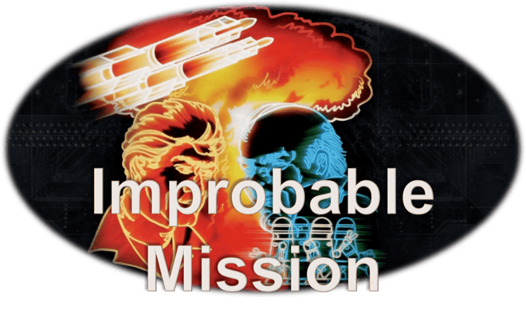
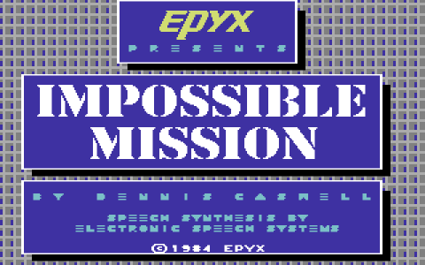
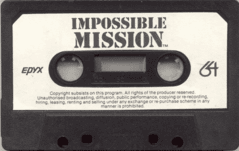
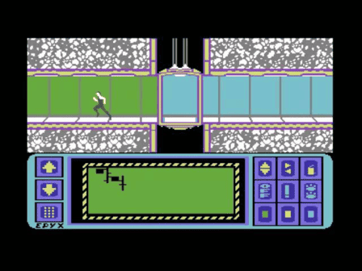
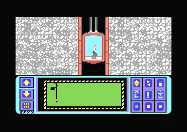

<h1 align="center">

</h1>

<p align="center">
  <em>"Stay awhile ... stay forever!"</em>
</p>

<p align="center">
  <a href="https://github.com/jeffnyman/improbable-mission/actions/workflows/ci.yml">
    
  </a>
</p>

<p align="center">
  
  <a href="https://github.com/jeffnyman/playwright-hudl/blob/main/LICENSE">
    
  </a>
</p>

<p align="center">
  
  
</p>

---

> [!TIP]
> This project contains a [progress document](/docs/PROGRESS.md) that will let me indicate where I'm currently at in implementation. You can always check out an executing example of the [working game](https://jeffnyman.github.io/improbable-mission). These are early days so the definition of "working game" will be highly variable.

> [!NOTE]
> I have a [concept document](/docs/CONCEPT.md) that talks about the general design of the original game. I also have a [references document](/docs/REFERENCES.md) that shows some of the basis for this work and how I created my reference implementations.

---

In 1984, a maniacal villain taunted players from their Commodore 64 screens, and ["Impossible Mission"](https://en.wikipedia.org/wiki/Impossible_Mission) became an instant classic. With its groundbreaking digitized speech, acrobatic platforming, and race-against-time puzzle-solving, it captivated a generation of gamers on the C64, ZX Spectrum, and other home computers of the era.

<p align="center">
  
</p>

This game was published by [Epyx](https://en.wikipedia.org/wiki/Epyx) back in 1984.

<p align="center">
  <br>
  
</p>

This repository is my attempt to bring that iconic experience to the modern web through a JavaScript reimplementation. My slight rename of the game here is to make sure I run afoul of no suggestions of infringement. The use of "improbable" also reflects the likelihood of me actually being able to significantly reproduce this game, particularly in JavaScript.

Whether you're chasing nostalgia or discovering this gem for the first time, prepare to infiltrate the villain's stronghold, dodge deadly robots, and piece together a fiendish puzzle.

As the game manual stated, _"Good luck. The world is depending on you."_

## 🤖 The Mission Is ...

The premise of the game is simple. You are Agent 4125 and you must find all of the key cards hidden throughout the hideout of Professor Elvin Atombender, fit them together, and use them to unlock his secret lair where you can stop his plans for world destruction.

<p align="center">
  
</p>

The game combines some difficult platform jumping, puzzle solving, and exploration in one package. Without doubt the game does rely on some quick reflexes. The game also featured several different layouts, as well as other randomized elements, to vary the game playing experience.

<p align="center">
  
</p>

I also have a copy of the <a href="./assets/impossible-mission-manual.pdf">original manual</a> for the game.

## 🛠️ Developing

Make sure you have [Node.js](https://nodejs.org/en). The LTS version should be fine. You will also need the `npm` package manager, which comes with Node.js. A development environment or IDE with TypeScript/JavaScript support will help. [Visual Studio Code](https://code.visualstudio.com/) is a good choice.

Clone the repository:

```bash
git clone https://github.com/jeffnyman/improbable-mission.git
cd improbable-mission
```

Get a clean, reproducible install:

```bash
npm ci
```

This ensures you get the exact dependency versions locked in `package-lock.json`.

Husky is used to enforce linting and formatting before commits. The `prepare` script runs automatically when you install dependencies, so your Git hooks are ready to go.

This project uses Vite as the build system, so you can start a dev server:

```bash
npm run dev
```

To build the project:

```bash
npm run build
```

To preview the built project:

```bash
npm run preview
```

### 🧬 Code Quality

This project uses Prettier.

<p align="center">
  <a href="https://github.com/prettier/prettier">
    
  </a>
</p>
<p align="center">
  <a href="https://prettier.io/docs/en/index.html">
    
  </a>
</p>
<p align="center">
  <a href="https://stackoverflow.com/questions/tagged/prettier">
    
  </a>
</p>

Prettier is run as part of the precommit hooks. If you want to manually run Prettier to check for any issues, you can do this:

```bash
npm run format
```

You can also have the Prettier apply its style changes to whatever issues it has found:

```bash
npm run format:fix
```

This project uses TypeScript ESLint.

<p align="center">
  <a href="https://github.com/typescript-eslint/typescript-eslint">
    
  </a>
</p>
<p align="center">
  <a href="https://typescript-eslint.io">
    
  </a>
</p>
<p align="center">
  <a href="https://stackoverflow.com/questions/tagged/typescript-eslint">
    
  </a>
</p>

Linting is also run as part of the precommit hooks. If you want to perform lint checks manually, you can do this:

```bash
npm run lint
```

If you're feeling confident that the linter will be able to auto-fix any issues, you can run it like this:

```bash
npm run lint:fix
```

## 👨‍💻 Author

<p align="center">
  Made with 🤍 by <a href="https://github.com/jeffnyman">Jeff Nyman</a>
</p>

<p align="center">
  
</p>

<p align="center">
  Written in TypeScript ✨ Compiles to JavaScript for distribution.
</p>

<p align="center">
  <a href="https://testerstories.com" target="_blank" >
    
  </a>
</p>
<p align="center">
  <a href="https://www.linkedin.com/in/jeffnyman/" target="_blank" >
    
  </a>
</p>

## ☦️ Doxazein (δοξάζειν)

<p align="center">
  חֶסֶד וֶאֱמֶת אַל־יַעַזְבֻךָ קָשְׁרֵם עַל־גַּרְגְּרֹתֶיךָ כָּתְבֵם עַל־לוּחַ לִבֶּךָ
</p>

<p align="center">
"Let not mercy and truth forsake thee:<br>
bind them about thy neck;<br>
write them upon the table of thine heart."<br>
<em>Proverbs 3:3</em>
</p>

## 🕹️ Acknowledgements

This project stands on the shoulders of an 8-bit legend: **Impossible Mission** (1984), designed by Dennis Caswell and published by Epyx. This reimplementation is a fan-made tribute to the game that challenged a generation with its sinister laughter and impossible leaps.

## ⚖️ License

The code used in this project is licensed under the [MIT license](https://github.com/jeffnyman/improbable-mission/blob/main/LICENSE).

**Note:** This license applies _only_ to the code in this repository. The original game concept, design, and any original assets belong to their respective copyright holders.

✨ Long live the classics.
