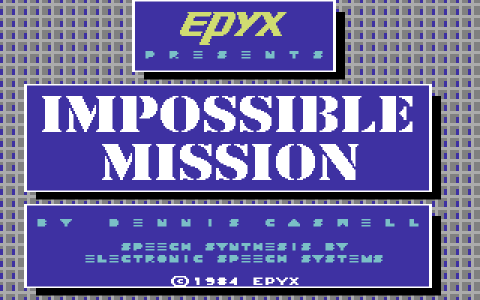
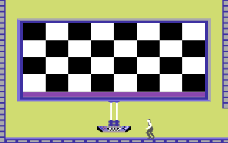
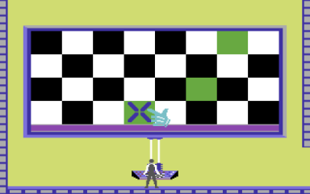

# 🕹️ Game Concept

Here I want to document the basic concept of the _Impossible Mission_ game, showing some screenshots from the original game. This is what my project has to recreate.

In the game, you take on the role of a secret agent ("Agent 4125") who is trying to stop a diabolical mastermind named Elvin Atombender (because of course _that_ would be his name!) from tampering with national security computers and causing a nuclear catastrophe.

Every game has a map. That map has a layout. The layout is made up of a series of rooms. Those rooms are distributed over a series of levels.

In the above image, you can see at the bottom in the green area the portion of the map that the player has explored. There are nine vertical columns where those rooms can be. There are six horizontal rows where those rooms can be. Each row is a level. There can be at most nine rooms per level. There can be at most six rooms per column.

There are eight elevator shafts. Each elevator shaft has a distinct elevator.

There are thirty-two rooms in a given game and those rooms are filled with furniture items, lift platforms, and robots.

There are thirty-six puzzle items, nine "snooze" items, and nine "lift reset" items. These are all placed into furniture items randomly. In fact, the game was programmed to generate your starting position, the rooms, robots and placement of the puzzle pieces at the beginning of each game, using about eight to ten set patterns.

Atombender has two types of robots that are programmed to systematically rip you apart, atom-by-atom. The first type of robot looks something like a four-foot grenade, and has varying levels of randomly assigned intelligence. Some of these are stationary. Some of them move in a pattern. Some charge at you if you get close to them. Some will move toward you regardless of where you are. These robots are confined to their platforms. If you're unlucky enough to touch one, you die. Instantly. Some robots randomly have weapons that shoot out some sort of lightning bolt which, again, will kill you. Instantly.

The other type of robot, which appears in less than half a dozen rooms, is a large, floating, electrified ball which either flies around in a pattern or stalks you around the room.

In addition to being killed by robots, you can also die by falling down a lift shaft.

You have unlimited lives but every time you die you lose ten minutes of game time. When you only have six hours total to beat the game, this is consequential.

Atombender's underground fortress is rather expansive. As the above images show, various pieces of furniture are strewn about the premises, and you will need search to each and every one to find all thirty-six pieces of an elaborately designed puzzle. Everything from desks to bookcases, to recliners, to toilets must be searched.

Most items you search will contain nothing; some will be very difficult to reach.

As mentioned, you are working against the clock. Luckily for you, there are a few things that can help you out. Sometimes when you search a piece of furniture, you will find a Lift Reset or a Snooze. (The Lift Resets are also called "lift inits," short for "lift initializers.")

These can be used at any computer terminal, and there is at least one terminal in every room.

Lift resets are basically special passwords that allow you to reset the position of all striped lifting platforms in a room. This is useful if you use a lift to reach a higher level, and then fall through a hole and can't get back up. Of course, you can reset the lift anytime by dying, but dying takes ten minutes of your time away.

Snoozes are even more useful; they shut down all the robots in a room for a short time, allowing you to walk past them without dying. Flying orbs will still kill you if you touch them, but they won't move.

There are other ways to earn Lift Resets and Snoozes. There are two rooms in _Impossible Mission_ that contain ridiculously large, checkerboard computer screens.

The first time you access one, it will light up three squares, each with a different tone. Your job is to push the buttons from lowest pitch to highest pitch, and when you do it correctly, you'll win either a Lift Reset or a Snooze.

Each time you access one of these computers, the number of notes you need to put in order increases by one.

As you've seen, to move around Elvin's complex, you will need to use the corridors and elevators, which are connected to the rooms. In the rooms you can access lift platforms to move to a level, so you can search any furnishings in the room. The elevator or corridor is the only place you can call headquarters for help and access your pocket computer. You will need to do this at some stage, to try and solve the puzzle. This is where the puzzle pieces come in.

Once you've searched through all the furniture in the professor's lair, you will find yourself in possession of thirty-six puzzle pieces. You must now take these puzzle pieces, and put them together to form nine solid card-type objects.

The only thing you have working for you is that the patterns can't overlap. The game will let you combine pieces that don't belong together, so you could have three pieces together, only to realize that you don't have a fourth piece that looks like what you need, and have to start from scratch again. Oh, but it gets better. The pieces aren't all in the right orientation either. You can flip the pieces horizontally and vertically too, so in reality, you have to pick four supplementary pieces out of a possible 144.

This is key to winning the game. It's important to understand that there are nine parts to the puzzle, which each contain four jigsaw pieces. When you have obtained the thirty-six pieces, you can attempt to crack each part, by putting the jigsaw pieces together.

Once all parts are completed, you will end up with nine letters which spell a word, which is randomly selected from about eight different nine letter words. This is the password required to enter the blue rectangle door in one of the rooms to confront and destroy Elvin.

So, the basic gameplay loop is to successfully manage to avoid being killed by robots,collect all thirty-six puzzles pieces, then solve all nine puzzles, and do all that before time runs out. If you do this, you will be in possession of the nine letter password to Professor Atombender's control room.

## Puzzle Logistics

I do want to focus a bit on the puzzle logistics because it's crucial to implement this correctly if you want someone to be able to win the game. Here are all of the puzzle pieces in _Impossible Mission_ but, crucially, this is in only one possible correct orientation and order.

Here is an example of one possible combination of solving the nine punch card puzzle.

Every time you play a new game, the pieces of the puzzle are somewhat randomly generated. The password is different from game to game, as well. The password is always nine letters long. At the start of the game each of the nine punch cards is split into four pieces using a recursive method.

What seems to happen is that each piece is split into two pieces and then each of those pieces are then split into two thereby dividing each card into four pieces. The splitting process uses a number of "cookie cutter" overlays. The cutters resemble the nine shapes in the second picture above except they have no punch holes in them.

The punch card is cut into two using one of the nine overlays then each of those two pieces is further divided into two using another. This has the interesting effect of ensuring there is a large number of permutations of different possible shapes to collect each of which is generated uniquely at the start of the game. It also means from game to game you should not expect all the thirty-six different puzzle pieces to look the same as they did on the previous game. The example in the first picture is only one of the many different collections of pieces you might find.

This is probably why the password contains nine letters. The game iterates through each of the nine cutters first and after that it electively chooses one of the other eight at random and uses it as the second cutter. This means it always uses three bits of the randomly generated number to choose the second cutter. This would imply that there are 134,217,728 different possible puzzles.

The solution that the above picture shows is the solution from _one game_. Play it again and the next time the pieces will be different.
