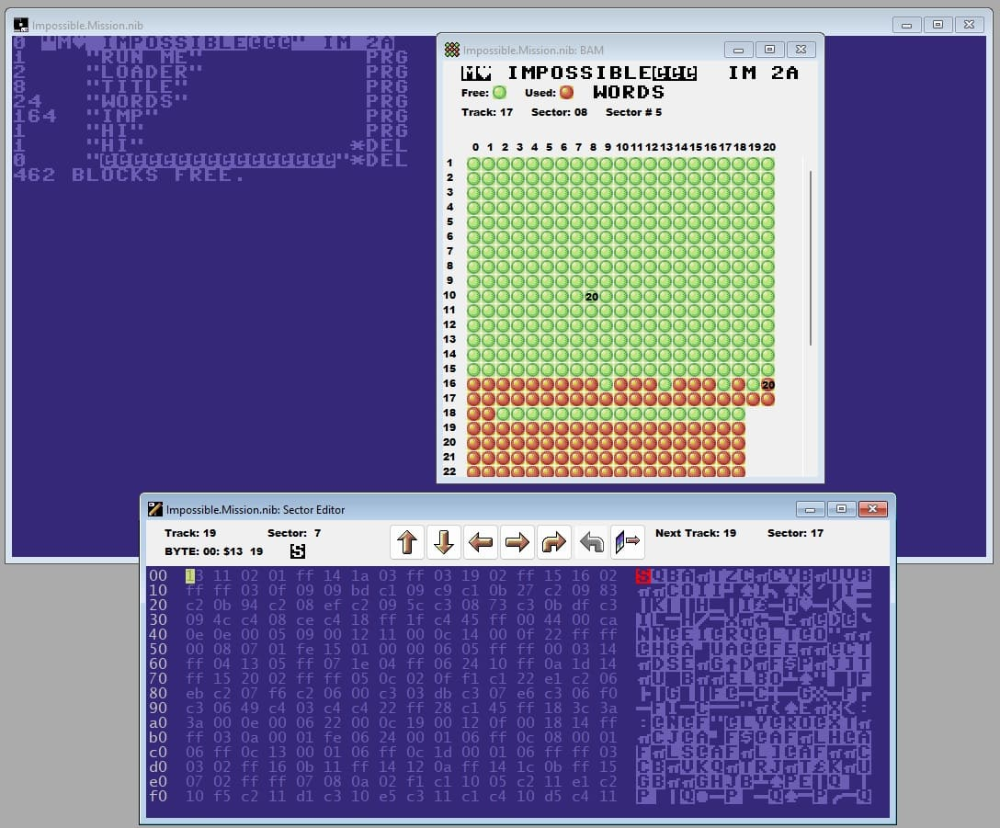
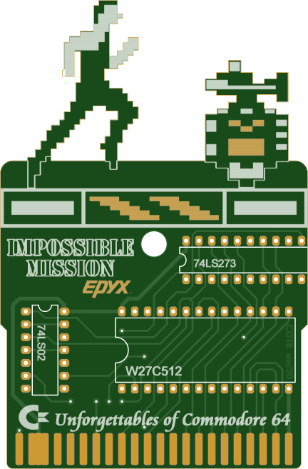

## 📚 Reference Implementations

The original source code for _Impossible Mission_ was, according to the original designer Dennis Caswell, lost in an earthquake.

I'm recreating what I can from a disassembly of one of the Atari 7800 ROM images of the game, obliquely referenced [in this thread](https://forums.atariage.com/topic/153052-impossible-mission-successful-recompile-of-source-code/).

<ul>
  <li><a href="../assets/roms/mission.a78">Impossible Mission (Atari 7800 version; fixed)</a></li>
</ul>

The "fixed" part refers to the fact that the most infamous port of _Impossible Mission_ was the Atari 7800 version of the game that was released in North America. This version was also called the "NTSC version" and it couldn't be completed due to a bug. The glitch prevented you from acquiring certain key items from computer terminals because those terminals were not searchable. This was fixed in the subsequent "PAL version."

I also have two binary files for the Commodore 64.

<ul>
  <li><a href="../assets/roms/mission.tap">Impossible Mission (C64 tape version)</a></li>
  <li><a href="../assets/roms/mission.d64">Impossible Mission (C64 disk version)</a></li>
</ul>

Those implementations were generated from a "nibbled" disk image that I was able to reference as well as a `.sid` file.

<ul>
  <li><a href="../assets/roms/mission.nib">Impossible Mission (disk image)</a></li>
  <li><a href="../assets/roms/mission.sid">Impossible Mission (sid image)</a></li>
</ul>

The `.nib` file includes all the intricate details of the original disk, preserving the exact, bit-for-bit layout of original game. A NIB is usually not directly runnable in an emulator, but it can be converted into other, more compatible formats, such as the `.tap` and `.d64` formats that I used.

The `.sid` file is a self-contained music program that includes 6502 machine code to play sound. The file contains code that manipulates the registers of the Commodore 64's SID sound chip, allowing it to generate music by synthesizing waveforms. Essentially, a SID file is a miniaturized C64 that runs on a modern computer's emulated hardware to reproduce the original C64 music.

With all of the above references, I found the tools [Retro Debugger](https://github.com/slajerek/RetroDebugger) and [DirMaster](https://style64.org/dirmaster) to be immensely helpful!

I also referenced [Andrea Capitani's tribute to the game](https://github.com/acapitani/im), which was written in Go, for the Defold game engine. This helped me understand how someone interpreted the data structures of the game and broke out the various assets. I found this wasn't an entirely faithful reproduction of the game.

There is also a [remastered version on Steam](https://store.steampowered.com/app/1449480/Impossible_Mission_Revisited/) and this "revisited" version was useful to see in terms of how _not_ to do things. I say that because this version is riddled with bugs.

## Cartridge and PCB

Another interesting approach here was one I came upon regarding using an actual PCB (printed circuit board). First, I have a <a href="../assets/roms/27c512_imp_mission.bin">binary EPROM image</a> file. But what is that?

This is part of a hardware cartridge that lets you run Commodore 64 games from ROM chips instead of loading them from disk or tape. Magic Desk Cartridge was a popular C64 cartridge format that used bank switching to access more memory than the C64's cartridge port normally allowed. It became a standard design that homebrew developers still use today.

The 27C512 EPROM is an erasable programmable read-only memory chip that holds 64KB (512 kilobits) of data. It's what physically stores the game code. Even though this is an EPROM chip, the file you burn to it is a `.bin` file. That's just the raw binary image of what goes on the chip.

The original Magic Desk carts could hold multiple programs, but this version is simplified to automatically boot one specific program (the `.prg` file) when you turn on the C64.

Great, but what do you do with that? Well, you need a PCB. This is the physical circuit board with all the traces, holes, and component placements already designed. Here is one example of that in schematic form:

That schematic is specifically laid out to replicate the original Epyx _Impossible Mission_ cartridge hardware. The implementation has through-hole components. These are the electronic parts (resistors, capacitors, the EPROM socket, etc.) that you solder into the PCB yourself. "Through-hole" means they have wire leads that go through holes in the board. This is much easier for hobbyists than surface-mount components. The EPROM image (`.bin` file) is the actual game code/data that needs to be programmed (burned) onto a blank 27C512 EPROM chip.

Thus, the steps are relatively simple.

1. You get a PCB manufactured (or you design it yourself).
2. You buy the electronic components and solder them onto the PCB.
3. You take a blank EPROM chip and use an EPROM programmer to "burn" the provided `.bin` file onto it.
4. You insert the programmed EPROM into the socket on your assembled PCB.
5. You now have a working _Impossible Mission_ cartridge!

Think of it this way: the PCB is the hardware blueprint, and the EPROM image is the software that runs on it. They're providing both pieces so anyone can recreate a physical cartridge of the game. This is common in the retro gaming community. People create reproduction carts of rare or homebrew games this way. Here is what that looks like when implemented:

THe cartridge design needs are well known.

**W27C512 (27C512 in DIP28 package)**

- This is the 64KB EPROM chip that holds your game code.
- DIP28 means it's a 28-pin Dual Inline Package (the classic chip with legs on both sides).
- W27C512 is Winbond's version; other manufacturers like Atmel (AT27C512) also make compatible chips.

**74LS02 or 74HC02 (DIP14)**

- This is a quad 2-input NOR gate logic chip.
- It's used for address decoding and control logic.
- You can use either LS (Low-power Schottky TTL) or HC (High-speed CMOS) versions. HC is more modern and uses less power.

**74LS273 or 74HC273 (DIP20)**

- This is an octal D-type flip-flop with clear.
- It's used for bank switching (selecting which 8KB or 16KB chunk of the EPROM is visible to the C64 at any given time).
- Again, either LS or HC versions work.

**DIP28 WIDE IC SOCKET**

- A socket for the EPROM chip so you don't have to solder it directly
- It's "WIDE" because EPROMs in DIP28 packages are wider than standard 28-pin chips.
- This makes it easy to remove/reprogram the EPROM if needed.

So, essentially, you need to source these four items, solder the three ICs/socket onto the PCB, burn the game image to the EPROM, and pop it in the socket. You can use [Magic Desk Cartridge Generator for Single PRG](https://github.com/Feandreu/mdeskcrtgenfsp) to prepare a single autostarting file based on the EPROM image file. The easiest way to test the binary image file is with an emulator, like [VICE](https://vice-emu.sourceforge.io/).
