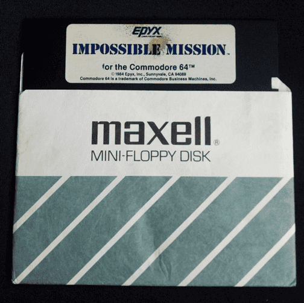
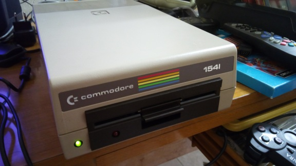
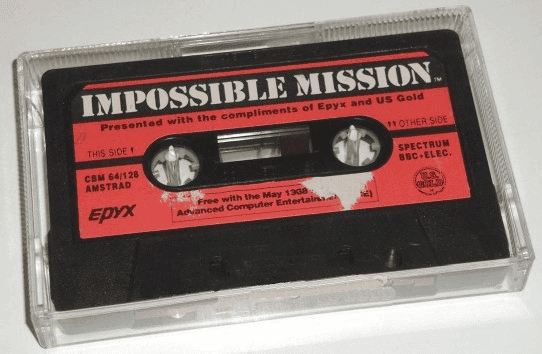
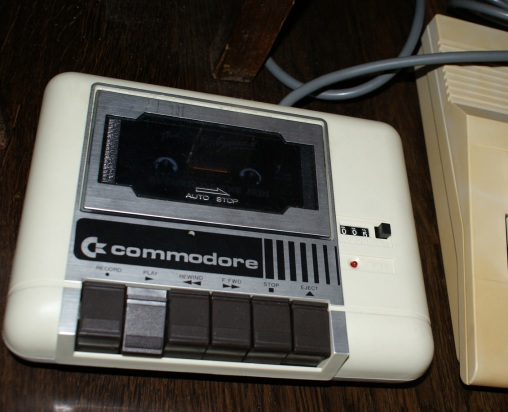
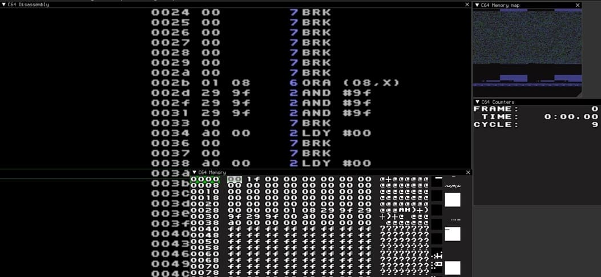
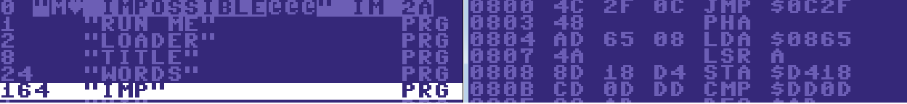
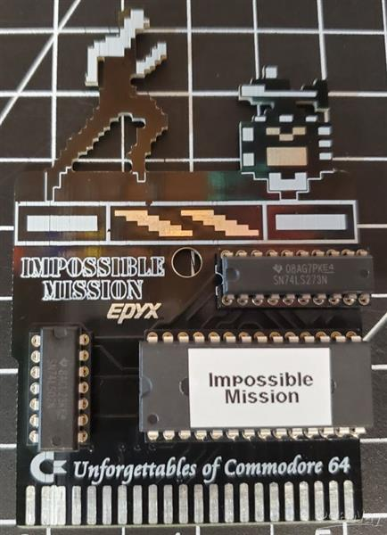

# 📚 Reference Implementations

The original source code for _Impossible Mission_ was lost during the 1989 Loma Prieta earthquake, which damaged Epyx's offices and scattered and destroyed many assets. So, any attempt to remake the game means starting from scratch or reverse-engineering existing ROM images.

I'm sort of doing both. I'm writing a JavaScript implementation which, by definition, means starting from scratch but I'm also using the assets from the original game ROMs as well as using those to understand the logic. I did this with my disk and tape versions of the game. Here I'll provide some of the archaeology for this process.

## Disk Version

There actually are existing ROM images out there but I wanted to do this myself. So, I dug out my old Commodore 64 disk of _Impossible Mission_.

  

First, I grabbed my trusty Commodore 1541 disk drive from storage, hoping it still worked after all these years. The drive's hum as I powered it on was like a time machine, taking me back to the '80s.

  

To get the disk's data onto my modern PC, I used a [ZoomFloppy](https://www.go4retro.com/products/zoomfloppy/). This is a nifty little device that bridges the gap between retro hardware and USB. I connected the 1541's IEC serial port to the ZoomFloppy, plugged the USB into my computer, and installed the drivers. The setup felt like assembling a puzzle, but once everything was hooked up, I was ready to tackle the disk.

I was pretty sure _Impossible Mission_ used Epyx's Vorpal copy protection, which was notorious for throwing in non-standard track and sector layouts or even deliberate disk errors to thwart pirates. That meant a standard `.d64` file might not cut it, so I turned to [NibTools](https://c64preservation.rittwage.com/dp.php?pg=nibtools), a specialized tool for handling those protections. I popped the disk into the 1541, launched NibTools' `nibread` on my PC, and ran the command to read the raw disk data into a `.nib` file. The drive whirred and clicked for a few minutes, and I held my breath, hoping the disk hadn't degraded. Success! A `.nib` file appeared on my desktop!

<ul>
<li><a href="../assets/roms/mission.nib">Impossible Mission (disk image)</a></li>
</ul>

The `.nib` file includes all the intricate details of the original disk, preserving the exact, bit-for-bit layout of original game. This kind of file is usually not directly runnable in an emulator, but it can be converted into other, more compatible formats, such as the `.tap` and `.d64` formats that I used.

In fact, next, I used NibTools' `nibconv` to transform that raw `.nib` file into a `.d64` image, which is the standard format for C64 emulators. To make sure everything looked right, I opened the `.d64` in [DirMaster](https://style64.org/dirmaster), a handy program that lets you peek inside the disk's directory. There they were: the game files, ready to go. I fired up the [VICE emulator](https://vice-emu.sourceforge.io/), attached the `.d64` to the virtual drive, typed `LOAD"$",8` and `LIST`, then loaded the game with `LOAD "IMPOSSIBLE",8,1` and then, finally, `RUN`. When I heard that iconic digitized voice ("Another visitor! Stay awhile ... STAY FOREVER!"), I knew I'd nailed it. My piece of gaming history was now safely preserved as a `.d64` file.

<ul>
<li><a href="../assets/roms/mission.d64">Impossible Mission (C64 disk version)</a></li>
</ul>

I wanted to extract just the music as a `.sid` file. First, I opened my `.d64` file in DirMaster, the tool I had used to check the disk image. It showed me the game's files, a mix of PRG (program) files containing code and data. I knew the music for _Impossible Mission_, that pulsing SID chip goodness, was buried in there somewhere, but finding it wasn't as simple as copying a file. The SID music is driven by 6502 machine code that tweaks the SID chip's registers to create waveforms, so I needed to isolate that code.

I started by checking the [High Voltage SID Collection (HVSC)](https://www.hvsc.c64.org/) online to see if _Impossible Mission_'s music was already documented. Sure enough, it listed a `.sid` file for the game, credited to Mark Cooksey, with details like the memory addresses where the music player lived. This gave me a head start, but I wanted to try extracting it myself from my own disk image. I downloaded [SID-Wizard](https://csdb.dk/release/?id=221555) and [C64 Debugger](https://csdb.dk/release/?id=170893), tools that let you analyze and manipulate C64 code, and fired up VICE to poke around.

In VICE, I attached my `.d64` file and loaded the game, but this time I used the emulator's monitor to inspect the memory. The HVSC entry suggested the music player was loaded around $1000-$2000 in memory, so I set a breakpoint to pause the game when the sounds started playing. As the title screen loaded and then the level appeared, I stepped through the 6502 code, watching for instructions that poked values into the SID chip's registers ($D400-$D418). It felt like being a digital archaeologist, sifting through hexadecimal to find the heart of the sound.

Extracting the code manually was daunting, so I turned to [PSID64](https://psid64.sourceforge.io/), a tool designed to convert game sounds and music into `.sid` files. I fed it my `.d64` file and pointed it to the game's main program file (the one that loaded the title screen). PSID64 analyzed the file, looking for common SID player patterns, and after a few minutes, it output a `.sid` file.

<ul>
<li><a href="../assets/roms/mission.sid">Impossible Mission (sid image)</a></li>
</ul>

I wasn’t sure it worked, so I opened [SIDPlay](https://csdb.dk/release/?id=221083), a dedicated SID sound/music player, and loaded the file. There it was! The `Impossible Mission` sounds blaring through my speakers, no emulator required.

Just to be thorough, I tested the `.sid` file in VICE, attaching it as a standalone program. I typed `SYS` followed by the init address from the HVSC documentation, and the sounds played perfectly, proving I had captured the essence of the game's soundtrack.

## Tape Version

Along with the disk I had, I found my old Commodore 64 cassette of _Impossible Mission_ tucked away as well. Its plastic case a little scratched but still intact.

  

I already had what I needed but I thought: "Hey, why not turn this analog relic into a digital `.tap` file?" So, I dusted off my Commodore Datasette, the quirky tape player that came with my C64, and checked that it still powered on. Its familiar clunk as I inserted the tape felt like a handshake from an old friend.

  

To get the tape’s data onto my PC, I needed to digitize the audio signal. I didn't have a fancy USB audio capture device, so I used a simple cassette-to-audio adapter: a little gizmo with a 3.5mm headphone jack that fits into the Datasette. I plugged it into my PC's microphone port, opened [Audacity](https://www.audacityteam.org/), and set it to record at 44100 Hz, 16-bit, mono, since C64 tapes are mono signals. I rewound the tape to the start, hit Play on the Datasette, and started recording in Audacity. The tape's high-pitched squeals and whines filled the room, a nostalgic soundtrack of loading screens from my childhood! I recorded the entire side to be safe, then saved it as a `.wav` file.

Now came the tricky part: turning that `.wav` into a `.tap` file. As with the disk procedure, I knew _Impossible Mission_ might be using Epyx's FastLoad or Vorpal loader, which could complicate things, so I downloaded [TAPClean](https://sourceforge.net/projects/tapclean/), a tool designed to handle C64 tape formats and clean up errors. Using [TAPClean's GUI](https://www.luigidifraia.com/tag/tapclean/), I loaded my `.wav` file, selected the C64 tape format, and checked the option for FastLoad compatibility, just in case. The program chugged along, analyzing the audio and fixing any glitches from the aging tape. After a few minutes, it spat out a shiny `.tap` file.

<ul>
<li><a href="../assets/roms/mission.tap">Impossible Mission (C64 tape version)</a></li>
</ul>

To make sure it worked, I launched the VICE emulator and set it up to emulate a Datasette. I attached the `.tap` file, typed `LOAD` in the emulator, and hit the virtual Play button. The screen flickered as the game loaded, just like it did back in the day. When I typed `RUN` and heard Elvin Atombender’s menacing voice, I couldn’t help but grin. My tape was now a `.tap` file.

I didn't need to regenerate the `.sid` file here but had I done so, the process would have been similar to what I mentioned for the disk but I would have started with loading the `.tap` in VICE and extracting the game's program data to a `.prg` file using TAPClean or [WAV-PRG](https://wav-prg.sourceforge.io/). From there, I would use PSID64 or C64 Debugger to isolate the music code, just like with the disk. The tape's custom loader (possibly Epyx FastLoad) likely would have needed extra tweaking in TAPClean, but the SID extraction would follow the same path.

## MicroProse Did This, Too!

I wasn't the first to follow a process somewhat like this. By the early '90s, [MicroProse](https://en.wikipedia.org/wiki/MicroProse) wanted to revive the game as a more modern side-scroller with scrolling levels, updated graphics, new characters, and enhanced audio, while preserving the core essence. Without access to the high-level source, MicroProse's team, specifically programmers Tim Cannell and Paul Dunning, had to reverse-engineer and data mine the assets directly from the existing Commodore 64 ROMs. This involved hacking into the binary data to extract and convert the original sprites, tiles, sounds, and other graphical elements for reuse in their Amiga version, which led to the 1994 remake [_Impossible Mission 2025_](https://en.wikipedia.org/wiki/Impossible_Mission_2025).

It's worth noting that _Impossible Mission 2025_ wasn't just a straight port. It included new scrolling levels, updated graphics, additional characters, and enhanced audio. The Commodore 64 assets served as a foundation for the classic rooms and enemies to maintain fidelity to the original's look and feel, but MicroProse also created new sprites and environments to modernize the game for the Amiga audience.

## The (In)famous Atari 7800 Version

An Atari 7800 port of _Impossible Mission_ was released in 1987 by Epyx as part of the original game's multi-platform rollout, which also included ports for systems like the Atari 8-bit, Apple II, and ZX Spectrum. The 7800 version was developed to bring the Commodore 64 classic to Atari's console, but the NTSC version (used primarily in North America) suffered from a critical bug that made the game unwinnable.

The bug relates to the game's core mechanic: collecting puzzle pieces to form a password to stop Elvin Atombender. In the NTSC Atari 7800 version, a coding error caused the puzzle pieces to be randomized incorrectly, making it impossible to assemble the correct password within the game's time limit. This effectively broke the game, as players could collect all pieces but never complete the mission. The PAL version (used in Europe and other regions) did not have this bug, so it was playable and completable.

I did find one of the Atari 7800 ROM images of the game, obliquely referenced [in this thread](https://forums.atariage.com/topic/153052-impossible-mission-successful-recompile-of-source-code/).

<ul>
<li><a href="../assets/roms/mission.a78">Impossible Mission (Atari 7800 version; fixed)</a></li>
</ul>

However, I did not find this very helpful. What I instead did was create my own disassembly from the `.nib` resource.

## Equally Infamous Steam Version

There is also a [remastered version on Steam](https://store.steampowered.com/app/1449480/Impossible_Mission_Revisited/) and this so-called "revisited" version was useful to see in terms of how _not_ to do things. I say that because this version is riddled with bugs.

## Decoding the Logic

At this point, I had my hands on my clean `.d64` file of _Impossible Mission_, digitized from my old disk using ZoomFloppy and NibTools to bypass that pesky Vorpal copy protection. Playing it in VICE showed me that it all worked. However, I wanted (needed, actually) to know _how_ it worked. What made the robots tick? How did the game generate those puzzle rooms? Since the original source code was long lost, I decided to disassemble the game's code to uncover its secrets.

I started by firing up VICE again and attaching my `.d64` file to the virtual drive. I typed `LOAD"$",8` and `LIST` to peek at the disk's directory, spotting the main program file, `IMPOSSIBLE`. I loaded it with `LOAD "IMPOSSIBLE",8,1` and ran it to make sure it worked. As before, the title screen loaded, and the music kicked in, but I wasn't here to play. I wanted to dig into the code. I opened [Retro Debugger](https://github.com/slajerek/RetroDebugger), a slick tool that works with VICE to let you step through 6502 code like a detective.

  

In Retro Debugger, I attached the same `.d64` and started the game, then hit pause to bring up the debugger's interface. It showed me the C64's memory, registers, and a live disassembly of the code running at $0801, the typical start address for C64 programs. The screen was a sea of opcodes (LDA $D020, STA $C000, JSR $1234, and so on) but I knew the game's logic was in there somewhere. I set a breakpoint at the start of the main game loop, which I guessed was called after the title screen. By stepping through, I watched the program jump to routines that handled player input (like joystick reads at $DC00) and sprite updates (writing to $D000-$D01F for VIC-II).

_Impossible Mission_'s Vorpal protection made things tricky. Some code seemed to decrypt itself at runtime, a common anti-piracy trick. To get around this, I used Retro Debugger's memory watch to track writes to key areas, like $D400-$D418 (the SID chip for music) and $D000-$D01F (sprite positions). I noticed a loop that updated robot positions, calling a subroutine around $2000 that seemed to calculate their paths based on the player's location. That had to be a core part of the logic!

To dig deeper, I extracted the main `.prg` file from the `.d64` using DirMaster, saving it as `impossible.prg`.

  

I fed it into [64tass](https://tass64.sourceforge.net/), a 6502 assembler/disassembler, to generate a text file of the full assembly code. The output was a little overwhelming. But I searched for patterns, like accesses to $D011 (VIC-II control) for screen updates or $C000-$CFFF for game data. I found a chunk of code that randomized room layouts, using a seed stored in memory to shuffle platform and object positions. It was like decoding a map of Elvin Atombender’s lair! In the end, I was able to compare this with what I got from the direct `.nib` disassembly.

  

<ul>
<li><a href="../assets/roms/mission.asm">Impossible Mission Assembly</a></li>
</ul>

The digitized speech intrigued me most. I set a breakpoint on SID writes ($D400) and found a routine pushing waveform data to produce that famous "Stay awhile... STAY FOREVER!" It was stored as raw samples, a rare trick for 1984, and played via a custom interrupt routine. By jotting down notes and sketching a flowchart, I started to see the game's logic: a main loop for input and updates, subroutines for enemy logic and collisions, and clever data tables for rooms and puzzles.

It wasn't easy (indirect jumps made my head spin) but Retro Debugger's visualizations, such as memory maps and register logs, helped me piece it together. I saved my annotated disassembly and felt like I had cracked open a time capsule, understanding how _Impossible Mission_ ticked, from robot chases to password puzzles. Now, I could even imagine tweaking the code to make my own hacks, like faster agents or new room layouts. However, at this point, my goal was just to recreate the basic game as it was.

## Side Trip: Cartridges and PCBs

At this point, I had already digitized my _Impossible Mission_ Commodore 64 disk into a `.d64` file using ZoomFloppy and NibTools, and I had even poked through its code with Retro Debugger to understand its logic. But now, I wanted to take it to the next level: a real, physical cartridge I could plug into my C64, just like the arcade-style carts from the '80s. I found a homebrew approach using a Magic Desk cartridge PCB, and I was ready to dive in.

First, I needed the game's binary in a format suitable for a cartridge. My `.d64` file contained the game's main program, but cartridges use EPROM chips, specifically a 27C512, which holds 64KB of raw data as a `.bin` file. I opened my `.d64` in DirMaster and extracted the main `.prg` file, as I did above for the disassembling, which held the game's code and data. Again, since _Impossible Mission_ used Epyx's Vorpal protection, I grabbed a cracked version from [CSDb](https://csdb.dk/) to ensure the code would run cleanly without disk checks. I used the [Magic Desk Cartridge Generator for Single PRG](https://github.com/Feandreu/mdeskcrtgenfsp) to convert the `.prg` into a cartridge-compatible `.bin` file. This tool wrapped the program with a simple autostart loader, mapping it to the Magic Desk's bank-switching scheme, which lets the C64 access chunks of the 64KB EPROM.

<ul>
<li><a href="../assets/roms/27c512_imp_mission.bin">binary EPROM image</a></li>
</ul>

Next, I needed the hardware. I ordered a pre-designed Magic Desk PCB from a retro gaming site. Its green circuit board and neatly labeled through-hole slots looked like a model kit for geeks.

  

The schematic shown above called for a few key components: a W27C512 EPROM chip (64KB, DIP28 package), a 74LS02 quad NOR gate for address decoding, a 74LS273 octal flip-flop for bank switching, and a wide DIP28 socket for the EPROM. Through-hole parts were a relief! Way easier to solder than tiny surface-mount chips. I sourced everything from an electronics supplier, double-checking that the 74LS series would work, although 74HC versions are fine, too, and sip less power.

With my components ready, I set up my soldering station, the faint smell of flux filling the air. I carefully soldered the DIP28 socket, 74LS02, and 74LS273 onto the PCB, following the schematic's layout. Each pin snapped into place with a satisfying click, and my multimeter confirmed no short circuits. Now for the EPROM: I used a TL866II Plus programmer, a nifty USB device that burns `.bin` files onto chips. I inserted a blank W27C512 EPROM, loaded my game `.bin` into the programmer's software, and hit "Burn." A progress bar ticked up, and in under a minute, the chip was ready. I popped it into the PCB's socket, double-checking the orientation to avoid frying it.

  

The moment of truth came when I slid the cartridge into my C64's expansion port. I powered on the system, and instead of the usual `LOAD` and `RUN`, the screen flickered to life with _Impossible Mission_'s title screen, the music pulsing through the SID chip. “Another visitor!” boomed Elvin Atombender’s voice and that felt good! This was instant retro magic, no disk drive required. To be safe, I had tested the `.bin` file first in VICE, using its cartridge emulation, and it ran perfectly, confirming the binary was good before burning.

My custom cartridge felt like a time machine, blending 1984 code with 2025 DIY spirit. The PCB's bank-switching logic let the C64 access the full 64KB, and the through-hole design made it a fun weekend project. I stashed the cartridge next to my original disk, proud to have brought _Impossible Mission_ back to life in a new form.

That, ultimately, is what the _Improbable Mission_ project is all about: bringing the classic back to life in a modern form, playable in a browser.
